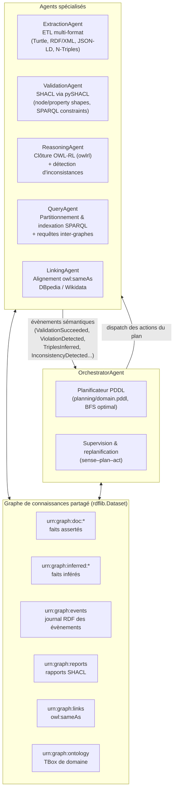

# G5 — Architecture agentique sémantique pour le traitement de documents RDF

**EPITA SCIA 2026 — Intelligence Symbolique**

Ce projet implémente une **architecture multi-agents symbolique** dans laquelle
cinq agents spécialisés traitent un flux de documents RDF hétérogènes, sous la
supervision d'un **agent orchestrateur** qui planifie et replanifie le flux de
traitement à l'aide d'un **planificateur PDDL/STRIPS écrit from scratch**. La
coordination repose sur un **graphe de connaissances partagé** (blackboard
RDF à graphes nommés) et un **protocole de communication par évènements
sémantiques** eux-mêmes matérialisés en RDF, donc interrogeables en SPARQL.

## Architecture



### Boucle plan → exécution → supervision → replanification

1. Pour chaque document, l'orchestrateur construit un **problème PDDL** à
   partir de l'état courant (`raw`, `needs-linking`, ...) avec pour but
   `(processed doc)` et calcule un **plan optimal** (BFS sur l'espace d'états
   STRIPS) : typiquement `extract → validate → reason → revalidate → [link] →
   index → publish`.
2. Chaque action du plan est dispatchée à l'agent qui la déclare (`handles`).
3. L'issue **réelle** est observée via les évènements sémantiques. La
   planification classique étant déterministe alors que l'issue d'une
   validation ne l'est pas, toute contradiction avec l'effet attendu
   (`ViolationDetected`, `ExtractionFailed`, `InconsistencyDetected`) provoque
   la **correction de l'état du monde** — ajout du fait `(failed doc)` — puis
   une **replanification** : le seul plan atteignant encore le but passe alors
   par l'action `quarantine`.

### Protocole de communication sémantique

Chaque évènement est un individu RDF du vocabulaire
`ag: <http://epita.fr/scia/2026/g5/agents#>` persisté dans `urn:graph:events` :

```turtle
ev:00007-3f2a91bc a ag:ViolationDetected ;
    ag:emittedBy ag:ValidationAgent ;
    ag:concernsDocument <urn:doc:doc3> ;
    ag:violationCount 5 ;
    ag:timestamp "1752482..."^^xsd:double .
```

L'historique complet du pipeline est donc **auditable en SPARQL** (voir la
requête d'auditabilité dans `run_pipeline.py`).

## Installation et exécution

Le projet est géré avec [uv](https://docs.astral.sh/uv/) (`uv.lock` versionné,
environnement reproductible) :

```bash
uv sync                        # crée .venv et installe les dépendances verrouillées

# Démonstration de bout en bout sur le corpus hétérogène
uv run python run_pipeline.py

# Tests (25 tests : planificateur, agents unitaires, intégration)
uv run pytest -v
```

À défaut d'uv, `pip install -r requirements.txt` reste possible
(`requirements.txt` est conservé comme solution de repli).

## Corpus d'évaluation

| Document | Format | Scénario | Issue |
|---|---|---|---|
| `doc1_datagouv_catalog.ttl` | Turtle | Catalogue type data.gouv.fr (INSEE), conforme | **publié** (+ liage DBpedia/Wikidata) |
| `doc2_transport.rdf` | RDF/XML | Jeu transport.data.gouv.fr, conforme | **publié** (+ liage) |
| `doc3_energie.jsonld` | JSON-LD | Titre manquant, `modified < issued`, mbox invalide | **quarantaine** (5 violations SHACL, 1 replanification) |
| `doc4_dbpedia_excerpt.nt` | N-Triples | Extrait DBpedia + dataset Vélib | **publié** (+ liage) |
| `doc5_broken.ttl` | Turtle invalide | Erreur de syntaxe | **quarantaine** (ExtractionFailed) |
| `doc6_inconsistent.ttl` | Turtle | Individu ∈ `foaf:Person ⊓ foaf:Organization` (disjointes) | **quarantaine** (InconsistencyDetected par OWL-RL, règle cax-dw) |
| `doc7_postinference_violation.ttl` | Turtle | Conforme à l'assertion, mais l'inférence type un individu `foaf:Person` sans `foaf:name` | **quarantaine** (échec à la *revalidation* post-inférence, 1 replanification) — *fixture de test* |

## Résultats (extrait de `docs/evaluation_report.json`)

* **Débit** : le raisonnement OWL-RL domine le coût du pipeline (~60 % du temps
  agent) ; le débit absolu (documents/s, triplets/s) dépend de la machine et est
  reporté tel quel dans `docs/evaluation_report.json`.
* **Couverture de validation** : 11 contraintes SHACL évaluées par passe
  (property shapes + contrainte SPARQL), 8 passes de validation (validation +
  revalidation post-inférence), taux de conformité 0,875, violations ventilées
  par sévérité (`sh:Violation`, `sh:Warning`).
* **Qualité du raisonnement** : 67 triplets *métier* inférés hors bruit de
  clôture réflexif/axiomatique (ratio moyen ×1,9 par document), 1 inconsistance
  détectée, 6 liens `owl:sameAs` produits. Exemple d'inférence non triviale : la
  restriction `dcat:Dataset ⊓ ∃ dct:publisher.PublicBody ⊑ ex:GovDataset` permet
  de répondre à la requête « quels sont les jeux de données gouvernementaux ? »
  alors qu'aucun document n'asserte ce type.

## Correspondance avec les objectifs du sujet

| Objectif | Réalisation |
|---|---|
| ≥ 4 agents spécialisés + orchestrateur | 5 agents (`ExtractionAgent`, `ValidationAgent`, `ReasoningAgent`, `QueryAgent`, `LinkingAgent`) + `OrchestratorAgent` |
| Agents = modules autonomes, RDF en entrée / graphes enrichis-validés en sortie | Chaque agent lit/écrit des graphes nommés du blackboard (`src/rdf_agents/agents/`) |
| Protocole d'évènements sémantiques + graphe de connaissances partagé | `events.py` (11 types d'évènements matérialisés en RDF) + `blackboard.py` (Dataset multi-graphes) |
| Planification du flux via PDDL | `planning/domain.pddl` + planificateur STRIPS from scratch (`planner.py`) + replanification supervisée (`orchestrator.py`) ; l'orchestration Semantic Kernel est l'alternative discutée dans `docs/ARCHITECTURE.md` |
| Évaluation sur corpus hétérogène : débit, couverture de validation, qualité du raisonnement | `metrics.py`, corpus 4 formats × 6 scénarios, rapport JSON |

## Arborescence

```
├── planning/domain.pddl          # domaine PDDL du pipeline
├── ontology/catalog.ttl          # TBox : DCAT/FOAF spécialisés, disjointness, inverses, transitivité, restriction ∃
├── shapes/dataset_shapes.ttl     # shapes SHACL (cardinalités, types, motifs, contrainte SPARQL)
├── data/corpus/                  # 6 documents de démonstration + 1 fixture de test
├── data/linked_data_cache/       # extraits DBpedia/Wikidata (exécution hors-ligne)
├── src/rdf_agents/
│   ├── planner.py                # parseur PDDL + recherche BFS (STRIPS typé, préconditions négatives)
│   ├── blackboard.py             # graphe de connaissances partagé
│   ├── events.py                 # protocole d'évènements sémantiques
│   ├── orchestrator.py           # plan / dispatch / supervision / replanification
│   ├── metrics.py                # évaluation
│   └── agents/                   # les 5 agents spécialisés
├── tests/                        # 25 tests pytest
└── run_pipeline.py               # démonstration de bout en bout
```

## Limites et extensions

* Le liage Linked Data fonctionne ici sur un cache local pour rester
  reproductible hors-ligne ; l'interrogation directe des endpoints SPARQL
  publics de DBpedia/Wikidata (avec repli sur le cache) reste une extension
  non implémentée.
* Le planificateur couvre le sous-ensemble STRIPS typé avec préconditions
  négatives ; le domaine reste volontairement compact. Une extension naturelle
  est l'ajout d'actions de **réparation** (p.ex. `repair-dates`) offrant au
  planificateur une alternative à la quarantaine.
* Les agents s'exécutent séquentiellement ; le protocole par évènements et le
  partitionnement par graphes nommés rendent la parallélisation par document
  directe.
